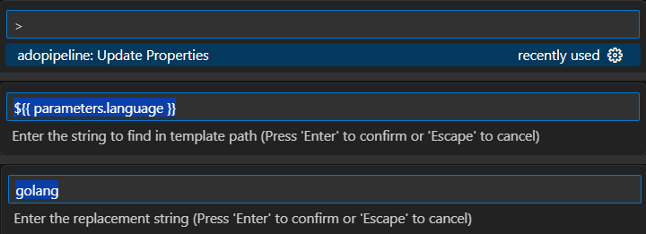

# Navigation for Azure Devops Pipeline


### How to use
- Paths will be underlined and show in different color
- Hover the mouse over the path to check the resolved path
- Use `Ctrl+Click` OR `F12` to navigate to that file.
- If the path is not resolved, it will show as File not Found: <path>
- If there are values that need to be replaced before resolving the path, this can be added in `Settings->User->ADO Pipeline Navigator->Adopipeline: Path Replacements->Edit in settings.json`
  
- The path replacements can be added in the settings.json as shown below. This will replace ${{ parameters.language }} with golang before resolving the path.
  ```
    "adopipeline.pathReplacements": [
        {
            "find": "${{ parameters.language }}",
            "replace": "golang"
        }
    ],
  ```
- For quick modification of the replacement string, this can be accessed that from the Command Palette by pressing `Ctrl+Shift+P` and choose `adopipeline: Update Properties`
  
  
  
